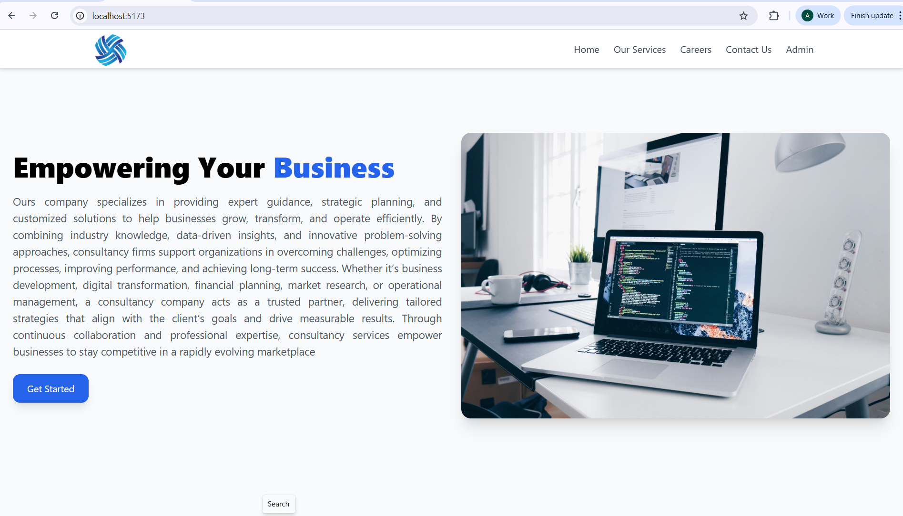
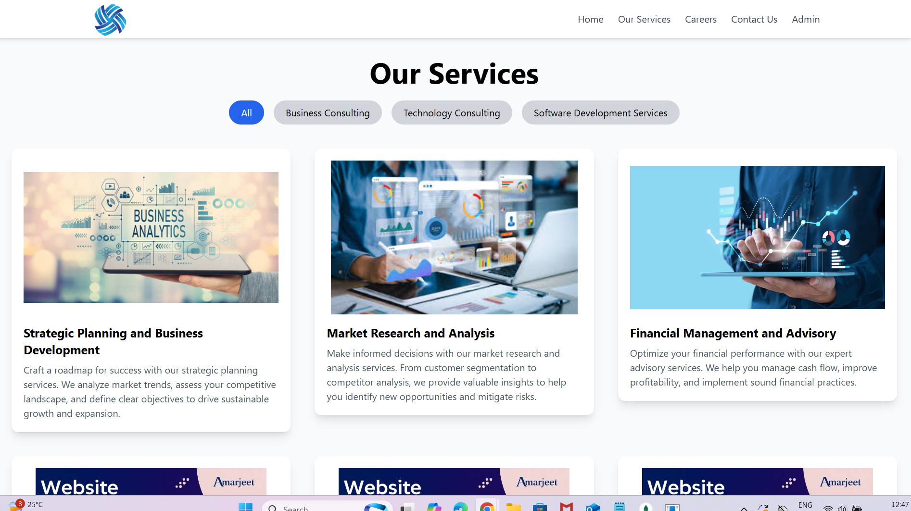
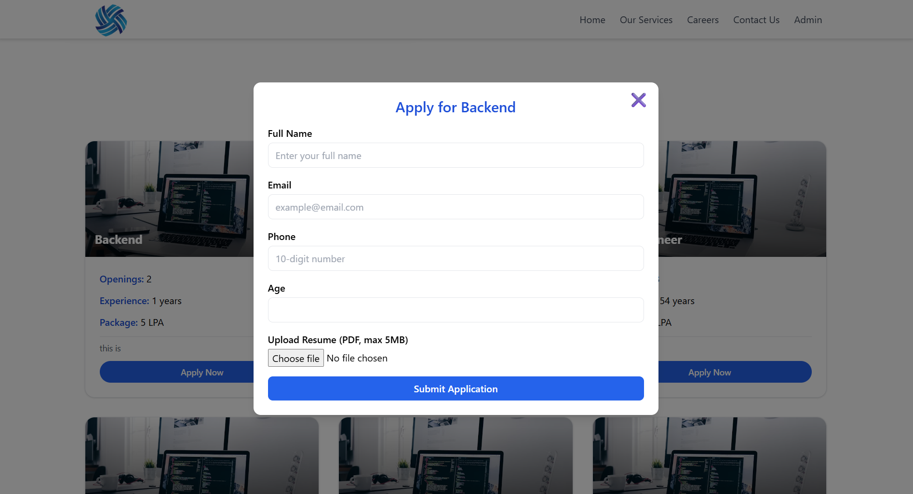
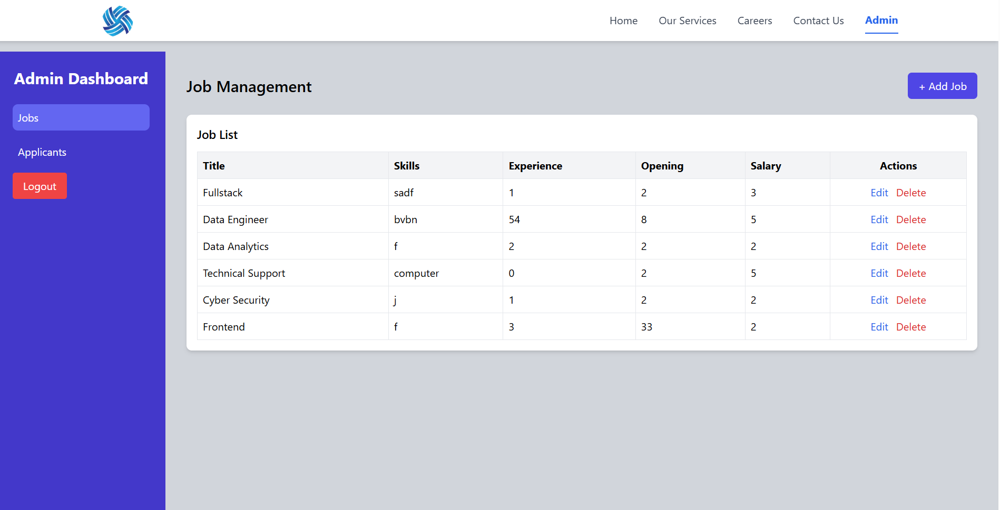
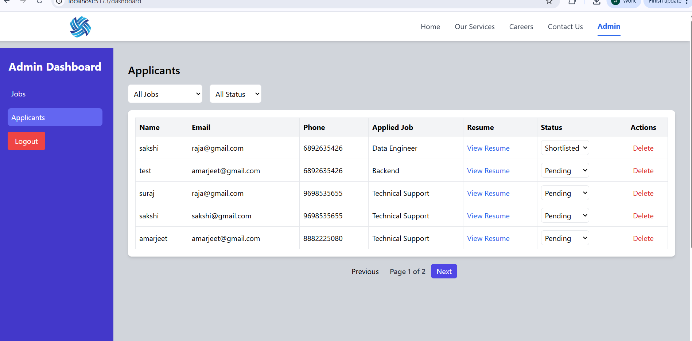
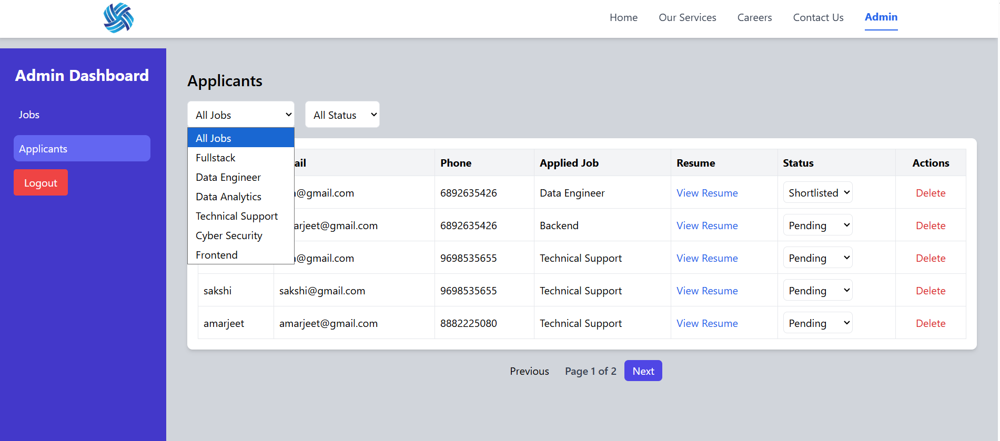
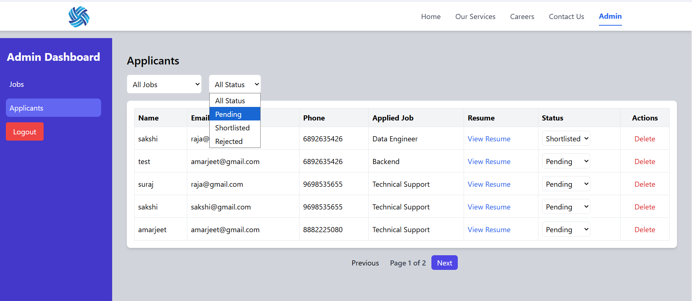
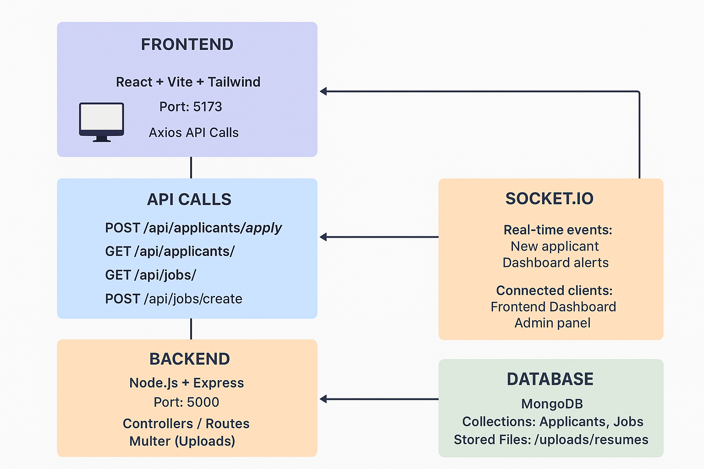

# Company Website – Full-Stack MERN Project

A complete full-stack application that includes a modern React (Vite + Tailwind) frontend and a Node.js + Express + MongoDB backend. This project supports job applications, resume uploads, real-time socket connections, and multiple frontend service pages.

---

##  Project Structure

```
Front_end/
│
├── public/
├── src/                      # Frontend (React)
│   ├── assets/
│   ├── Components/
│   │   ├── Careers.jsx
│   │   ├── CareersForm.jsx
│   │   ├── ContactUs.jsx
│   │   ├── DashBoard.jsx
│   │   ├── Footer.jsx
│   │   ├── Home.jsx
│   │   ├── NavBar.jsx
│   │   ├── OurServices.jsx
│   │   ├── ServiceDetail.jsx
│   │   ├── servicesData.jsx
│   └── image/
│
├── server/                   # Backend (Node.js)
│   ├── config/
│   │   ├── config.js
│   │   └── db.js
│   ├── controllers/
│   │   ├── applicant.controller.js
│   │   └── job.controller.js
│   ├── models/
│   │   ├── applicant.model.js
│   │   └── job.model.js
│   ├── routes/
│   │   ├── applicant.routes.js
│   │   └── job.routes.js
│   ├── sockets/
│   │   └── socket.js
│   ├── uploads/
│   │   └── resumes/         # Uploaded resume files
│   └── server.js
│
└── package.json
└── README.md
```

---

##  Tech Stack

**Frontend**

* React (Vite)
* Tailwind CSS
* Framer Motion (Animations)
* React Router
* Axios

**Backend**

* Node.js
* Express.js
* MongoDB + Mongoose
* Multer (Resume Uploads)
* Socket.io (Real-time communication)

---

##  Features

**Frontend**

* Fully responsive company website
* Homepage with animated service cards
* Services page with category filters
* Detailed service pages
* Contact us form
* Job application form with resume upload
* Dashboard page
* Smooth animations with Framer Motion

**Backend**

* API for job postings
* API for applicants
* Save uploaded resumes to `/uploads/resumes/`
* Real-time socket server for tracking applicants/admin events
* MongoDB model-based storage

---

## Installation & Setup

### 1️⃣Clone the Repository

```bash
git clone https://github.com/your-username/companyWebsite.git
cd Front_end
```

### 2️⃣ Install Frontend Dependencies

```bash
npm install
```

Start Frontend:

```bash
npm run dev
```

### 3️⃣ Install Backend Dependencies

```bash
cd server
npm install
```

Add `.env` File:

```
MONGO_URI=your_mongo_connection
PORT=5000
CLIENT_URL=http://localhost:5173
```

Start Backend:

```bash
node server.js
```

---

##  API Endpoints

###  Applicant Routes

| Method | Endpoint              | Description                     |
| ------ | --------------------- | ------------------------------- |
| POST   | /api/applicants/apply | Apply for a job + upload resume |
| GET    | /api/applicants/      | Get all applicants              |

###  Job Routes

| Method | Endpoint         | Description          |
| ------ | ---------------- | -------------------- |
| GET    | /api/jobs        | Get all job listings |
| POST   | /api/jobs/create | Create a new job     |

###  Upload Folder

Resumes are automatically stored in: `server/uploads/resumes/`

---

##  Real-Time Features (Socket.io)

* New Jobs events
* Dashboard notification events
* Client connection status

---

##  Sample Commands (Postman)

**POST:** `http://localhost:5000/api/applicants/apply`
Form-data:

```
name: Amarjeet Kumar
email: test@gmail.com
resume: <file>
```


##  Project Architecture Diagram

```
                       ┌───────────────────────────┐
                       │         FRONTEND          │
                       │  React + Vite + Tailwind  │
                       │  Axios API Calls          │
                       └──────────────┬────────────┘
                                      │
                                      ▼
                       ┌───────────────────────────┐
                       │         BACKEND           │
                       │  Node.js + Express        │
                       │  Controllers / Routes     │
                       │  Multer (Uploads)         │
                       │  Socket.io                │
                       └──────────────┬────────────┘
                                      │
                                      ▼
                       ┌───────────────────────────┐
                       │         DATABASE          │
                       │        MongoDB            │
                       │  Applicants & Jobs        │
                       └───────────────────────────┘
```

## ER + API Architecture Diagram

                       ┌───────────────────────────────┐
                       │          FRONTEND             │
                       │  React + Vite + Tailwind      │
                       │  Port: 5173                   │
                       │  Axios API Calls              │
                       │  Pages: Home, Services, Jobs  │
                       │  CareersForm, ContactUs       │
                       └───────────────┬───────────────┘
                                       │
             ┌─────────────────────────┴─────────────────────────┐
             │                    API CALLS                      │
             │---------------------------------------------------│
             │ POST /api/applicants/apply   → Upload Resume      │
             │ GET  /api/applicants/        → Get all Applicants │
             │ GET  /api/jobs/             → Get all Jobs        │
             │ POST /api/jobs/create       → Create Job          │
             └───────────────┬───────────────┘
                             │
                             ▼
                       ┌───────────────────────────────┐
                       │           BACKEND             │
                       │ Node.js + Express             │
                       │ Port: 5000                   │
                       │ Controllers / Routes         │
                       │ Multer (Uploads)             │
                       │ Socket.io (Real-time)        │
                       └───────────────┬───────────────┘
                                       │
            ┌──────────────────────────┴───────────────────────────┐
            │                     SOCKET.IO                        │
            │------------------------------------------------------│
            │ Real-time events: New Job, Dashboard alerts    │
            │ Connected clients: Frontend Dashboard, Admin panel   │
            └───────────────┬──────────────────────────────────────┘
                            │
                            ▼
                       ┌───────────────────────────────┐
                       │          DATABASE             │
                       │           MongoDB             │
                       │ Collections: Applicants       │
                       │             Jobs              │
                       │ Stored Files: /uploads/resumes│
                       └───────────────────────────────┘

---

## Screenshots Section


* Home Page


* Services Page

* Job Application Form

* Admin Dashboard





* Uml Diagram


